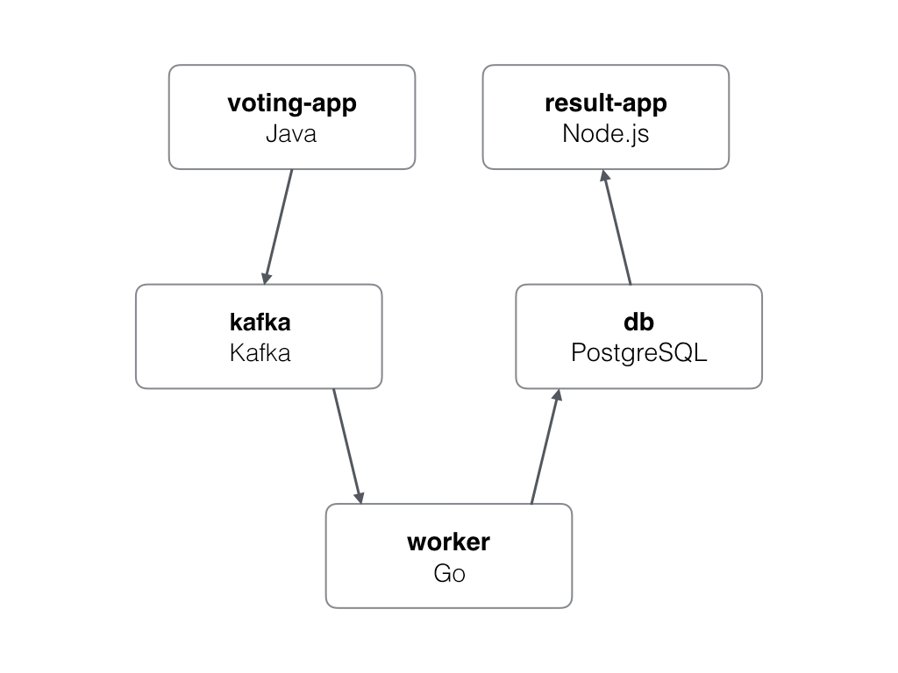

# Voting App

A simple distributed application running across multiple Docker containers.

The docker-compose.yml file is configured for hybrid development using the Okteto Docker Desktop extension.

## Architecture

* A front-end web app in [Java](/vote) which lets you vote between Tacos and Burritos
* A [Kafka](https://bitnami.com/stack/kafka/helm) queue which collects new votes
* A [Golang](/worker) or worker which consumes votes from Kafka and stores them in PostgresQL
* A [PostgresQL](https://bitnami.com/stack/postgresql/helm) database
* A [Node.js](/result) webapp which shows the results of the voting in real time
